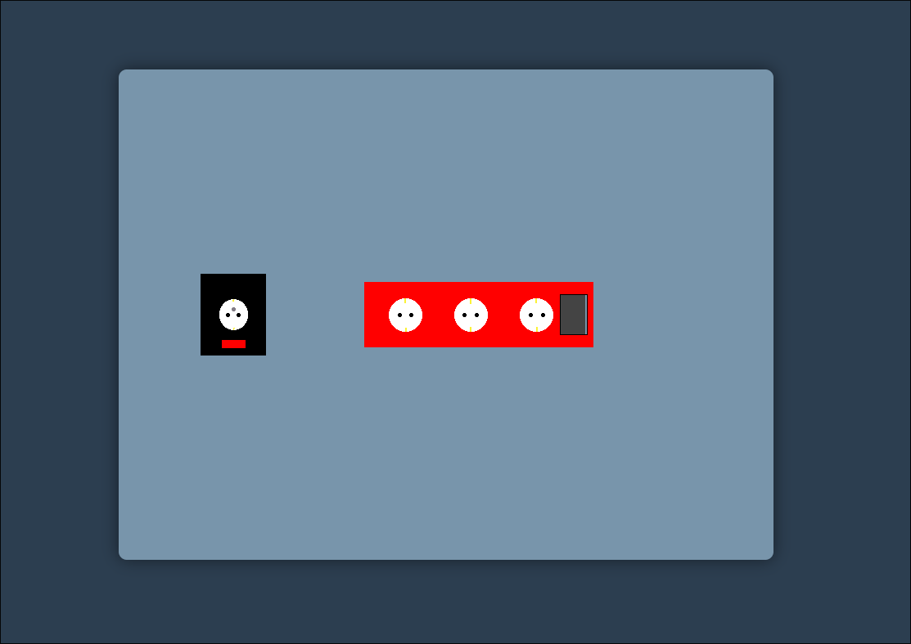
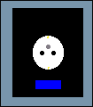
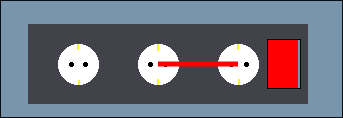
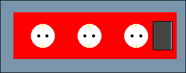
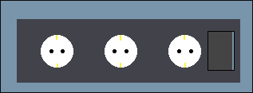
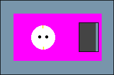

# Web Tabanlı Programlama - Oyun Geliştirme Projesi: Infinity Source

## 🎮 Orijinal Oyun Hakkında
Bu proje, kısıtlı sürede geliştirilen bağımsız bir "Game Jam" oyununun temel mekanikleri baz alınarak, hiçbir oyun motoru veya kütüphane kullanılmadan saf HTML5 Canvas ve JavaScript ile sıfırdan kodlanmıştır.

* **Orijinal Oyunun Adı:** Infinite Energy
* **Orijinal Oyunun Bağlantısı:** https://lightpotato.itch.io/infinite-energy

---

## 🎯 Oyunun Hedefi ve Zorluğu (Challenge)
Oyunun temel amacı, ekrandaki tüm çoklu prizleri ana elektrik şebekesinden bağımsız, kendi kendine yeten (sonsuz enerji) kapalı enerji döngüleri haline getirmektir.

* Fişler sadece kablo menzili içindeki yuvalara bağlanabilir.

* Her prizin beklenen rengi olabilir. İstisna olarak prizin rengi gri ise herhangi bir rengin sonsuz enerjisi yeterli olacaktır.

* Güç akışı tek yönlüdür; enerji her zaman bir kaynaktan diğerine doğru akar.

* Bazı prizlerin çalışabilmesi için özel renklerde (RGB karışımları) enerjiye ihtiyacı vardır. Gerekli rengi elde etmek için farklı renkteki akımları doğru prizlerde birleştirerek yeni renkler oluşturmalısınız.

* Bölümü geçmek için tüm prizlerin istenen renkte enerjiye sahip olması ve duvardaki ana kaynakların fişlerinin tamamen çekilmiş olması gerekir.

## 🖱️ Kontroller
Oyun tamamen fare (mouse) ile oynanmaktadır:
* **Fiş Takma:** Boş bir yuvaya (socket) sol tıklayıp basılı tutarak kabloyu çekin ve menzili içindeki başka bir yuvaya sürükleyip bırakın.
* **Fiş Çıkarma:** İçinde kablo bulunan bir yuvaya sol tıkladığınızda bağlantı anında kopar.

---

## 🛠️ Teknik Detaylar
* Projede hiçbir JS oyun kütüphanesi (Phaser vb.) kullanılmamıştır. Proje sadece tek bir HTML sayfası üzerinden çalışmaktadır.
* Tüm çizimler, fare etkileşimleri (hit-box hesaplamaları) ve enerji ağının takibi saf JavaScript ve HTML5 `<canvas>` API'si ile geliştirilmiştir.
* Güç akışının tespiti, döngülerin ayrıştırılması ve renk kombinasyonlarının hesaplanması için özel bir Graf algoritması (Breadth-First Search ve Cycle Detection) kodlanmıştır.
* Proje geliştirme sürecinde yapay zeka araçlarından destek alınmış olup, tüm prompt ve cevap süreçleri şeffaf bir şekilde repoda bulunan `AI.md` dosyasında belgelenmiştir.

---

## 📜 Kaynaklar ve Varlıklar (Assets)
Görsel tasarımların (pixel art prizler) tamamı tarafımca çizilmiştir. Aşağıda projede kullanılan dış kaynaklar belirtilmiştir:

* **Arka Plan Müziği:** ["8 bit Arcade" by moodmode](https://pixabay.com/music/search/8-bit/?pagi=2)
* **Ses Efektleri:** 
  * Fiş Tak/Çıkar Sesi: ["Pulling the Plug" by freesound_community](https://pixabay.com/sound-effects/search/plug-in/)
  * Oyunu Bitirme Sesi: ["Mount and Blade Quest Complete"](https://www.myinstants.com/en/instant/mount-and-blade-quest-complete/?utm_source=copy&utm_medium=share)